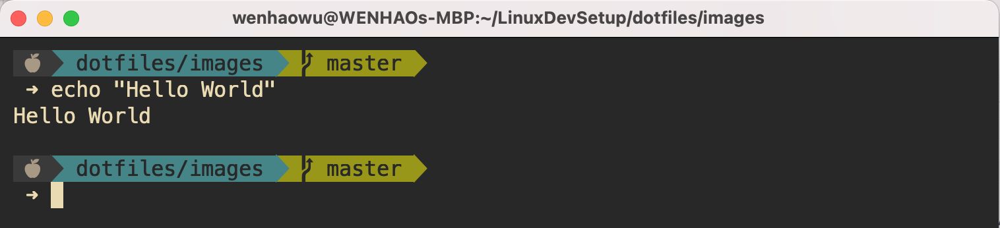
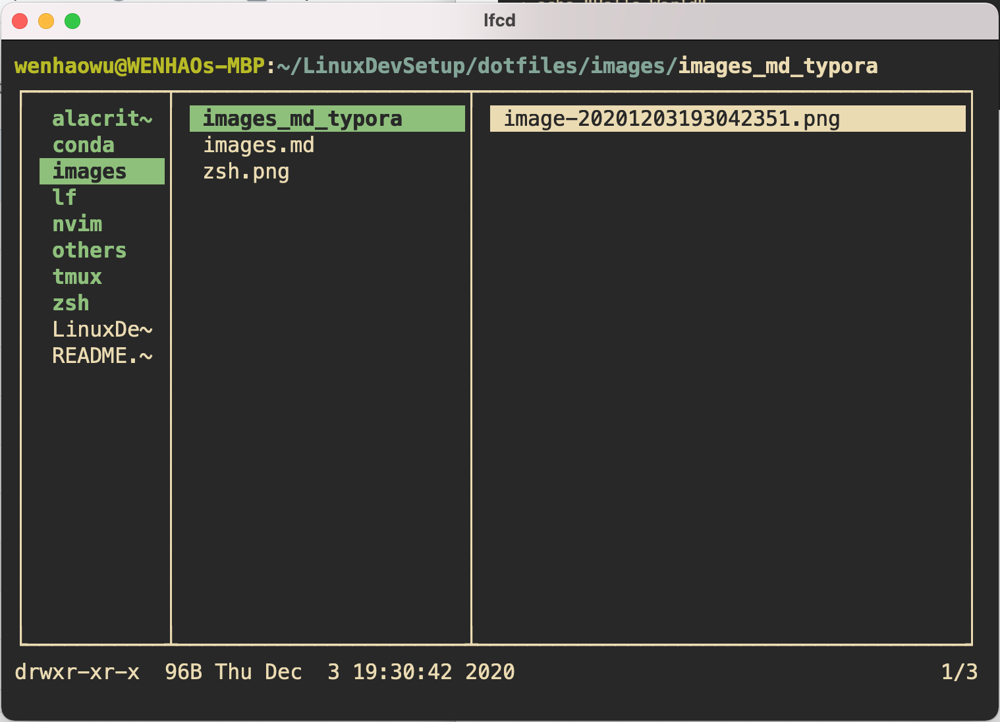
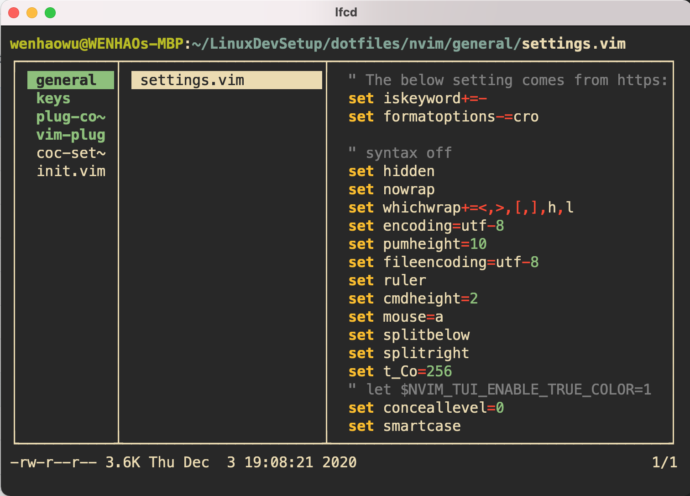
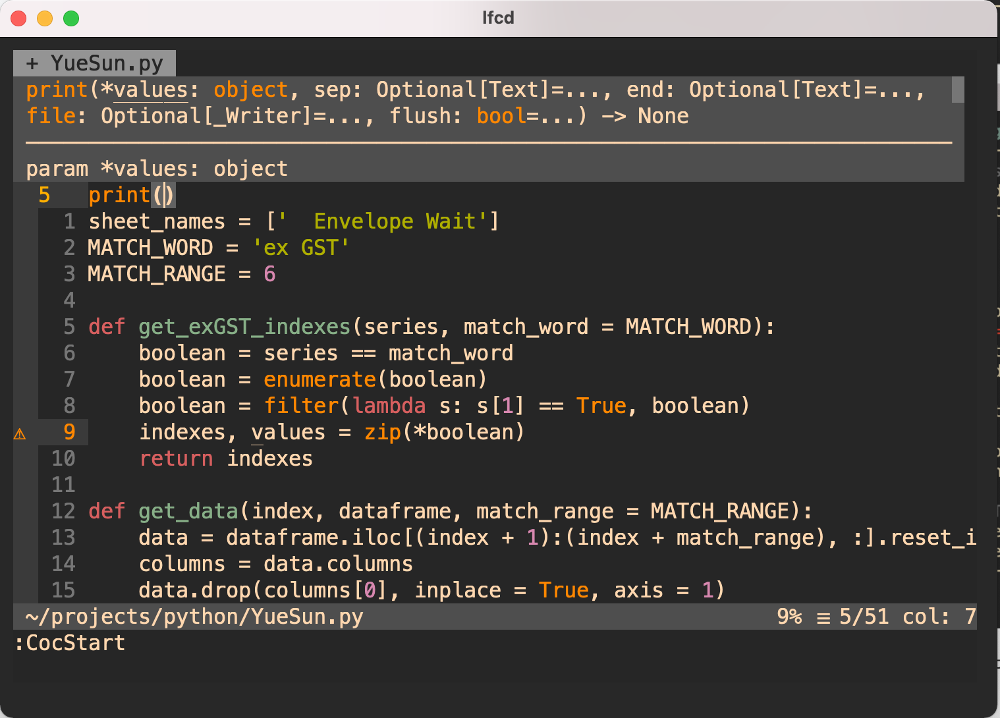
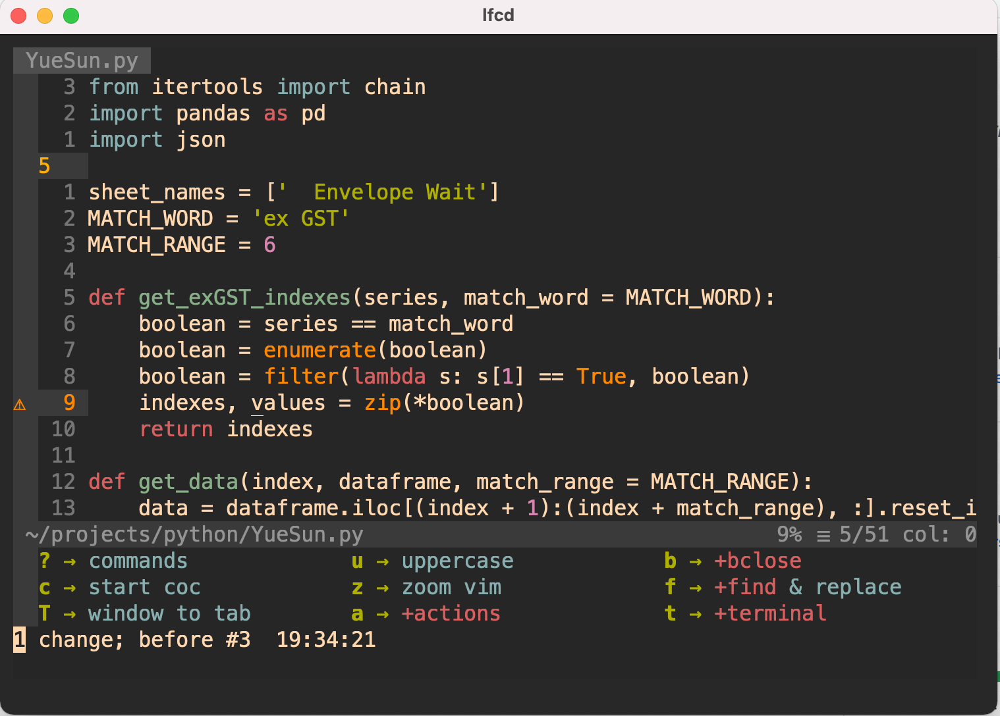

# dotfiles

This repo is composed of 
* command line programs ready to be integrated with neovim
* neovim and its plugins
* tmux (multiplexer) and alacritty (terminal)

Note: 
* File tree explorer is set to Lf, activated by `<c-n>`
* Coc is disabled at start. Enable it by `<leader>c` (leader key sets to be space)
* Nearly all features could be activated by pressing `<leader>` key, i.e. `<space>`. Exceptions are vim-surround plugins by pressing `s`, file tree explorer by `<c-n>`, fzf by `<c-p>` etc.
* Startuptime is ~130ms (the goal is <150ms even when cpu is high)
* Lack of git related integration
* Tested on macos (although repo says linux dev setup, it is actually ran on macos and will be used on linux in the future)

ToDo: 
* documentation (esp. why I choose such plugins)
* better session management in neovim 
* better folding levels in neovim

Performance:

